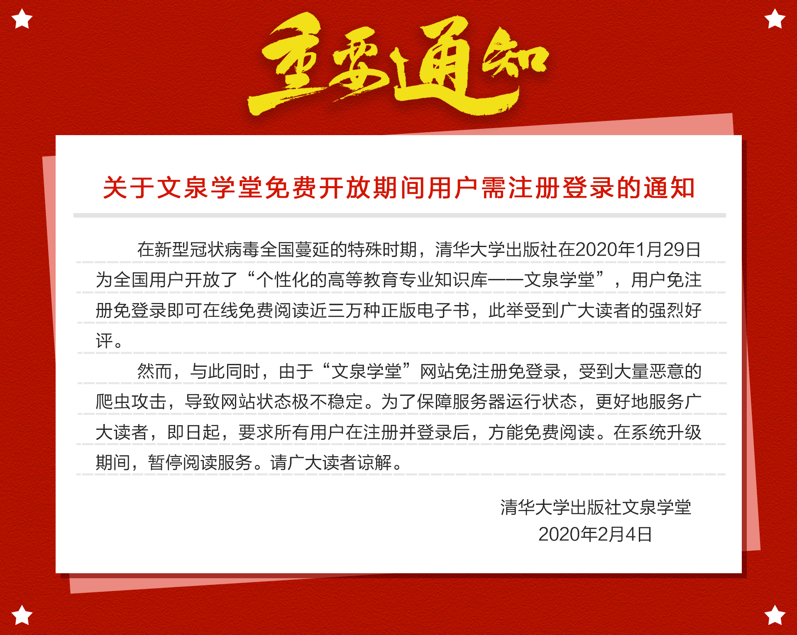

**最后更新更新时间：2020-02-05 22:43**





# 文泉学堂 离线阅读转换器

文泉学堂解析工具自动生成pdf，**方便**用户通过离线的方式阅读文泉学堂**免费**的资源。


利用`python3`自动下载文泉学堂学堂提供的免费的pdf书籍（仅供测试，请24小时内删除）


最后有效更新`commit ad0c71480c4eeaf338d09492237ed70e3d28d0be`


这个脚本的本质上就是将线上阅读转化为线下阅读。


切勿商用和广泛传播。


> 先说明，该阅读系统结构简单，任何有编程基础的人都可以独立完成爬取任务。我不认为网站遭受恶意爬虫是指我们程序。
>
> - 本脚本模拟了人的正常阅读，在用户不修改程序时，默认6-20秒（随机）阅读一个页面。
>
> - 该阅读速度远远小于受过[量子波动速读](https://baike.baidu.com/item/量子波动速读/4641373?fr=aladdin)训练的人的一分钟10w字。所以采取了较快于普通人而远慢于受过量子波动速度的人的速度，即6-20秒。
>
> - 该速度平均速度为13秒/页，一分钟4.6页，一小时4.6页 277页。阅读完一本书约需要1-2个小时。所以我认为[@miaoshengyou](https://github.com/miaoshengyou)的观点不成立。
>
> 最后提醒一句：**网络不是法外之地,网络言行需谨慎。**


[[issues/#27]](https://github.com/kajweb/wqxuetang_downloader/issues/27)

```
清华的资源不能为全体国人所共享，
平时只能为一小部分人所享，
其实是国家教育资源不平等的体现，是一个很扯很丢脸的事。

人类之所以技术发展到现在，
就是因为知识传播与技术共享，
让越来越多的人掌握科技，
人类的整体水平才不断发展。
```

## ❤免责声明

> 所发布的一切破解补丁、注册机和注册信息及软件的解密分析文章仅限用于学习和研究目的；不得将上述内容用于商业或者非法用途，否则，一切后果请用户自负。本站信息来自网络，版权争议与本站无关。您必须在下载后的24个小时之内，从您的电脑中彻底删除上述内容。如果您喜欢该程序，请支持正版软件，购买注册，得到更好的正版服务。如有侵权请邮件与我们联系处理。


## 安装与使用

[FAQ](https://github.com/kajweb/wqxuetang_downloader/wiki)

### 安装方法

* [安装方法](https://github.com/kajweb/wqxuetang_downloader/wiki/安装方法)

### 使用方法

* [一本书下载](https://github.com/kajweb/wqxuetang_downloader/wiki/一本书下载)
* [多本书下载](https://github.com/kajweb/wqxuetang_downloader/wiki/多本书下载)


## 🌙 更新与补丁

[更新与补丁](https://github.com/kajweb/wqxuetang_downloader/wiki/更新与补丁)


## ⚡ 版权问题
[爬虫学习](https://github.com/kajweb/wqxuetang_downloader/wiki/版权声明)


## 📃 LICENSE

[MIT](https://opensource.org/licenses/mit-license.php)


## 爬虫学习
[爬虫学习](https://github.com/kajweb/wqxuetang_downloader/wiki/爬虫学习)


## 其他渠道
[其他渠道](https://github.com/kajweb/wqxuetang_downloader/wiki/其他渠道)